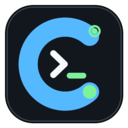

<div align="center">
  
  <h1>Consiglio</h1>
  <p><strong>A focused desktop workspace for persistent Codex tasks.</strong></p>
  <p>Start typing immediately. Keep the conversation, files, provider, and Codex thread when the app restarts.</p>
  <p>
    
    
    
    
  </p>
</div>

---

Consiglio wraps the Codex CLI in a native desktop workflow. It is designed for long-running work rather than disposable chats: tasks reconnect automatically, prompts and responses remain copyable, activity is visible, and repository files can be inspected without leaving the conversation.

## What It Does

| Surface | Behavior |
| --- | --- |
| **Conversation** | Streams prompts, responses, command activity, errors, and a clear working indicator. |
| **Task rail** | Keeps multiple tasks available and reconnects the last selected task at startup. |
| **Recovery** | Preserves Codex thread IDs, history, repository, provider, and per-task drafts across shutdowns and crashes. |
| **Files** | Browses the active workspace and previews text files and images in the app. |
| **Providers** | Runs the normal Codex profile, GPT-5.6, Ollama, remote llama.cpp, or discovered LAN endpoints. |
| **Secrets** | Encrypts API keys through Electron `safeStorage` and injects scoped environment variables into task processes. |
| **Approvals** | Surfaces command approval requests with the command and affected paths. |

## Start Here

### Requirements

- Linux desktop environment
- Node.js 20 or newer
- npm
- A working `codex` executable on `PATH`

### Install

```bash
git clone https://github.com/rickenator/Consiglio.git
cd Consiglio
npm install
mkdir -p ~/bin
ln -sf "$PWD/bin/consiglio" ~/bin/consiglio
```

Make sure `~/bin` is on `PATH`, then launch from any directory:

```bash
consiglio
```

The launcher builds the current checkout and opens the Electron app. No workspace selection is required: Consiglio reconnects the last task when one exists and creates a task against the Consiglio checkout when none exist.

## Everyday Workflow

1. Launch `consiglio`.
2. Type a request and press Enter.
3. Watch the working indicator and command activity while Codex runs.
4. Open **Files** to inspect generated files, text, or images.
5. Switch tasks from the left rail without losing conversation state.

Use `Shift+Enter` for a newline. Conversation text supports normal selection, copy, paste, and native right-click menus.

## Crash And Shutdown Recovery

Task state is written to Electron's user-data directory as work happens. On the next launch, Consiglio restores the selected task and reconnects it with the original Codex thread ID.

The following state survives a restart:

- Conversation and activity history
- Codex thread ID
- Repository and branch
- Provider, model, and endpoint identity
- Original task creation time
- Unsent composer draft for each task

If shutdown interrupts a response, Consiglio replaces the stale working state with a visible recovery message. Select **Continue task** to resume the same Codex thread instead of starting a disconnected conversation.

## API Keys And MCP

Open **Secrets** in the conversation header to add credentials. Consiglio stores only encrypted values on disk, restricts the secrets file to the current OS user, and never sends saved values back to the renderer. A saved value can be replaced or removed, but not revealed.

Each credential can be scoped to:

- All task providers
- Codex and OpenAI tasks
- Local and LAN model tasks

Credential updates apply to subsequent Codex task processes, including the next turn in an existing task.

### STDIO MCP Server

Reference the saved environment variable in `~/.codex/config.toml`:

```toml
[mcp_servers.example]
command = "example-mcp"
env_vars = ["EXAMPLE_API_KEY"]
```

### Streamable HTTP MCP Server

```toml
[mcp_servers.example]
url = "https://example.com/mcp"
bearer_token_env_var = "EXAMPLE_API_KEY"
```

The **MCP config** button beside a credential copies both patterns with the correct variable name.

> [!NOTE]
> Local llama.cpp and LAN sessions use isolated Codex profiles by default. Isolation keeps the normal Codex MCP server list out of those sessions; injecting a key does not install or configure an MCP server.

## Providers

### Codex

Uses the normal Codex profile, authentication, model configuration, and MCP configuration from the host.

### Remote llama.cpp

Consiglio configures Codex's OpenAI-compatible provider automatically. Supply the endpoint and model in **Providers**. A typical endpoint is:

```text
http://192.168.1.243:8081
```

The server must support the Responses API shape expected by Codex. The default placeholder API key is `llama.cpp`; replace it only when the server requires authentication.

### Ollama And LAN

Ollama can be selected directly. Compatible llama.cpp servers can also be added manually or discovered on the local network from **Providers**.

## Keyboard And Desktop Behavior

| Action | Shortcut or behavior |
| --- | --- |
| New task | `Ctrl/Cmd+N` |
| Send prompt | `Enter` |
| Newline in prompt | `Shift+Enter` |
| Restore task | Automatic at startup |
| Window size | Remembered between launches |
| Copy and paste | Native menu and standard platform shortcuts |

## Development

Run the complete desktop app:

```bash
npm run dev:all
```

Build all three application targets:

```bash
npm run build
```

Run TypeScript checks:

```bash
./node_modules/.bin/tsc --noEmit -p tsconfig.json
./node_modules/.bin/tsc --noEmit -p src/tsconfig.json
```

## Packaging

Build Linux packages with:

```bash
npm run package:linux
```

This produces an AppImage and a compressed Debian package. Linux is the primary desktop target.

GitHub Actions also builds release packages for all supported desktop platforms:

| Platform | Release artifacts |
| --- | --- |
| Linux x64 | AppImage and `.deb` |
| Windows x64 | NSIS installer and portable `.exe` |
| macOS x64 | DMG and ZIP |

Push a version tag matching `package.json`, such as `v0.1.0`, or run the **Release Consiglio** workflow manually with that version. GitHub publishes a release only after every platform package passes validation, and includes `SHA256SUMS.txt` for all artifacts.

## Architecture

```text
Consiglio
├── bin/consiglio                   durable launcher
├── src/main.ts                     Electron process, Codex runner, persistence
├── src/preload.ts                  narrow contextBridge API
├── src/App.tsx                     desktop shell
├── src/features/sessions/          task rail and conversation timeline
├── src/features/files/             workspace browser and previews
├── src/features/secrets/           encrypted credential manager
├── src/main/lan-discovery.ts       local provider discovery
└── tests/fixtures/codex-events/    protocol fixtures
```

The renderer never launches commands or reads credentials directly. Electron's main process owns Codex subprocesses, filesystem access, persistence, provider environment setup, and encryption. The preload bridge exposes a bounded IPC surface to React.

## Troubleshooting

### A prompt does nothing

Open the task activity and copy the displayed error. Confirm that `codex` runs from a terminal and that the selected provider is reachable.

```bash
codex --version
```

### MCP cannot see a key

Confirm all three parts independently:

1. The credential is enabled in **Secrets**.
2. The MCP server references the exact variable through `env_vars`, `bearer_token_env_var`, or `env_http_headers`.
3. The task uses a Codex profile that contains that MCP server configuration.

Restart or reconnect the task after changing MCP server configuration. Key presence and service/network reachability are separate checks.

### A local provider loses MCP tools

This is expected when local-provider isolation is enabled. Disable isolation only when the local model and provider can safely handle the configured MCP tool schemas.

## Design Rule

Consiglio must not become a toy abstraction over Codex. Every visual action should map to an inspectable task event, command, file operation, provider setting, or protocol message. Errors remain selectable and copyable so failures can be debugged from evidence rather than hidden behind generic UI states.

## License

Copyright 2026 Rick Goldberg and Aniviza LLC.

Licensed under the [Apache License 2.0](LICENSE). See [NOTICE](NOTICE) for attribution information.
